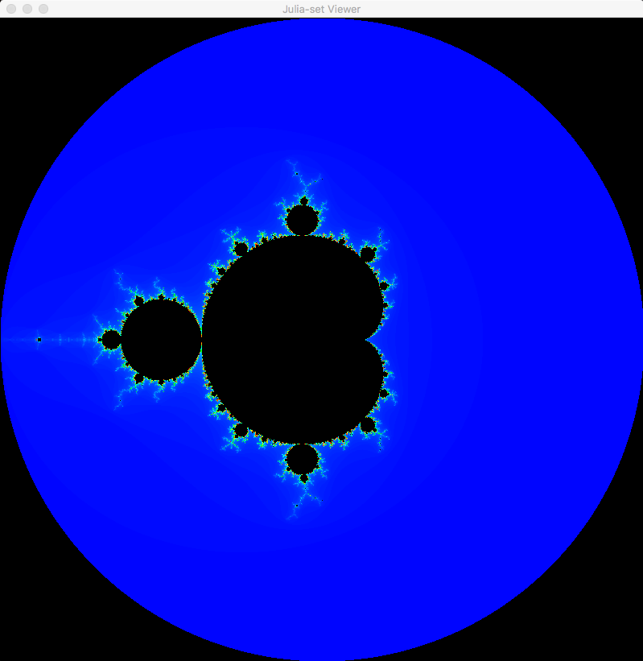
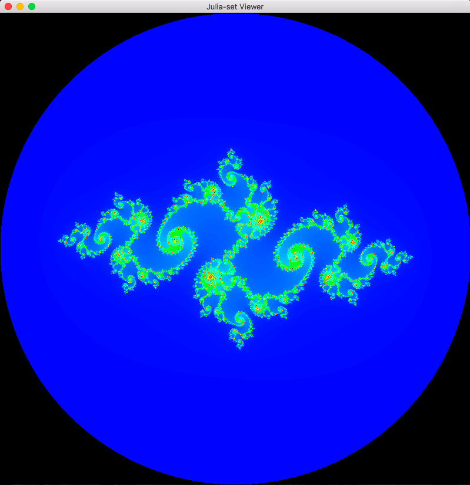
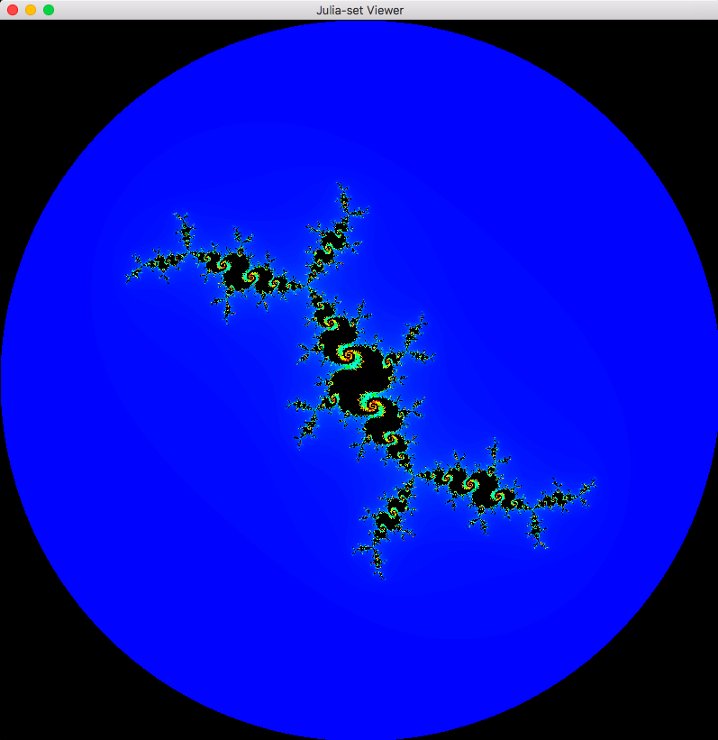
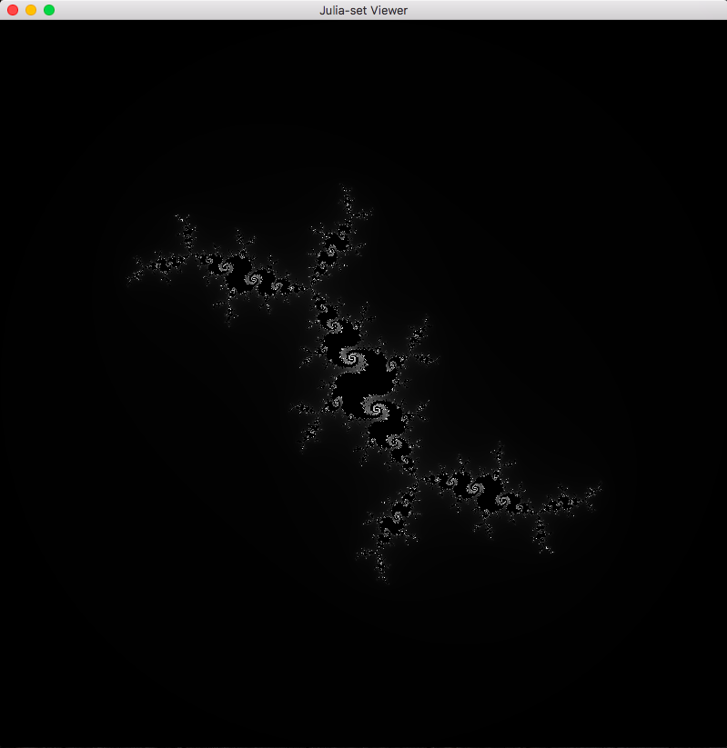

# Viewer for Julia sets
This is a program that displays [Julia-sets](https://en.wikipedia.org/wiki/Julia_set) as well as the [Mandelbrot set](https://en.wikipedia.org/wiki/Mandelbrot_set). You can set the mouse position as the constant value of the Julia-set. This gives a cool animation when moving the mouse.

### Hotkeys
- **M** - Toggle whether to use the mouse position as input for Julia set
- **C** - Toggle whether to display grayscale or color
- **Up/W** - Zoom in
- **Down/S** - Zoom out
- **Esc** - Reset to initial state

