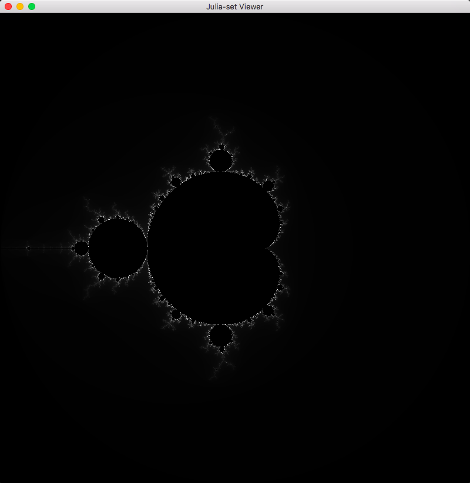
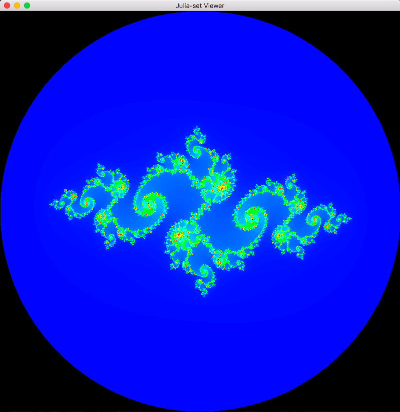
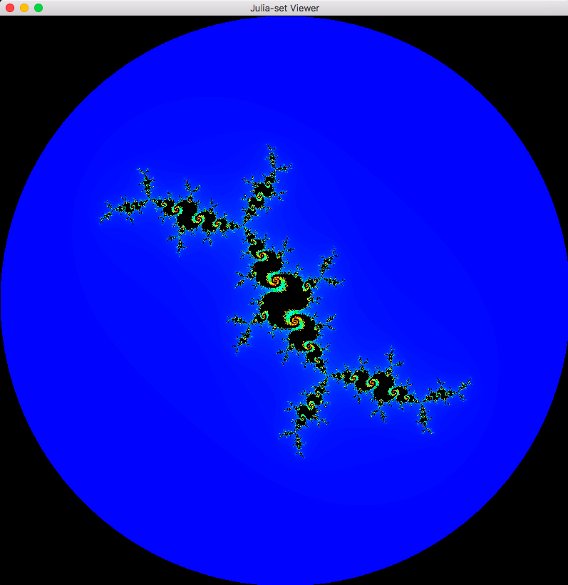
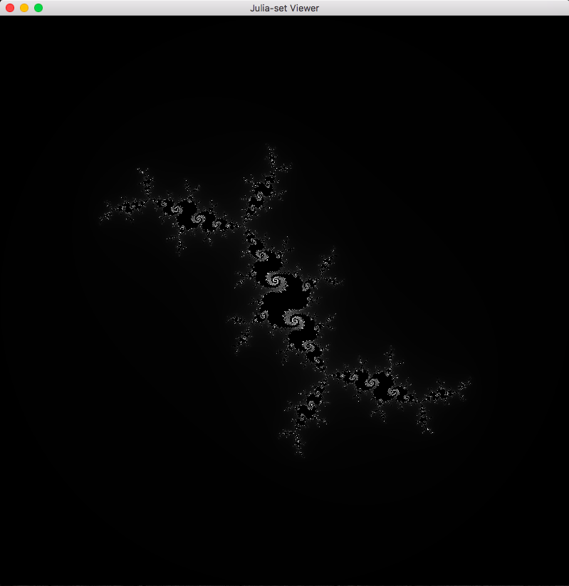

# Viewer for Julia sets
### Hotkeys
- **M** - Toggles weather to use the mouse position as input for Julia set
- **C** - Toggles wether to display grayscale or color
- **Up/W** - Zooms in
- **Down/S** - Zooms out
- **Esc** - Resets to initial state

### Screenshots

